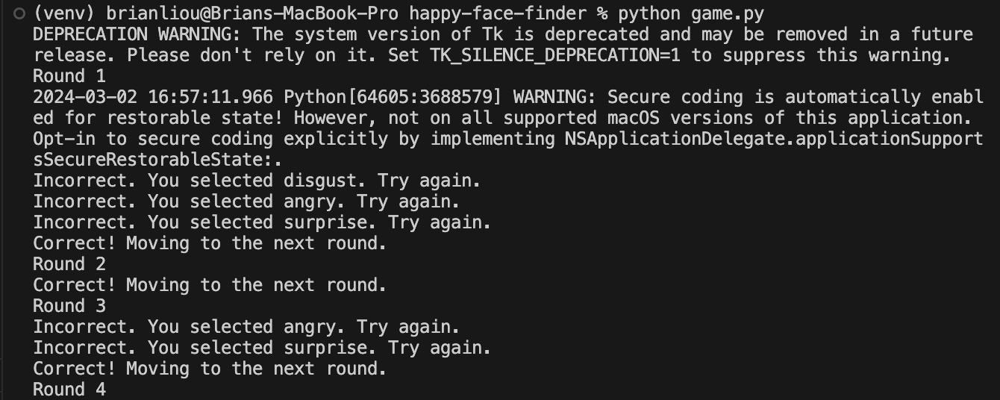

# Happy Face Finder Game

## Overview
Happy Face Finder is a cognitive bias modification game developed in Python using Tkinter. The game aims to train users to focus on positive stimuli by selecting a happy face among a grid of negative faces. It uses images from the FER-2013 dataset to create each round of the game.

## Screenshots




## How the Game Works
- The game displays a 4x4 grid of faces, with one happy face and fifteen negative faces.
- The user selects the happy face by clicking on it with the mouse.
- If the selection is correct, the game advances to the next round with a new set of faces.

## Installation and Setup
1. **Clone the Repository:**

```
git clone https://github.com/brianhliou/happy-face-finder.git
```

2. **Navigate to the Project Directory:**

```
cd happy-face-finder
```

3. **Create a Virtual Environment:**

```
python3 -m venv venv
```

4. **Activate the Virtual Environment:**
- macOS/Linux:

```
source venv/bin/activate
```
  
- Windows:

```
.\venv\Scripts\activate
```

5. **Install Dependencies:**

```
pip install -r requirements.txt
```


## Running the Game
1. **Download the FER-2013 Dataset:**
- Download the dataset from Kaggle: https://www.kaggle.com/msambare/fer2013
- Extract the dataset, and you'll find an `archive` folder.
- Inside the `archive` folder, navigate to the `train` folder.
- Copy the 7 emotion subdirectories (`happy`, `angry`, `disgust`, `fear`, `sad`, `surprise`, `neutral`) from the `train` folder into the `happy-face-finder/data` directory.

2. **Start the Game:**

```
python game.py
```

3. **Play the Game:**
- Click on the happy face in the grid.
- The game will provide feedback and advance to the next round for each correct selection.

## Cleaning Up

1. **Deactivate the virtual environment and exit:**

```
deactivate
```

## Contributing

Contributions to the Happy Face Finder game are welcome! If you have ideas for improvements or encounter any issues, please feel free to submit an issue or pull request on GitHub. 
